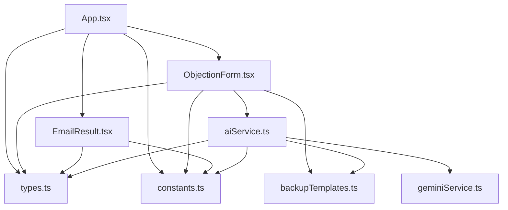
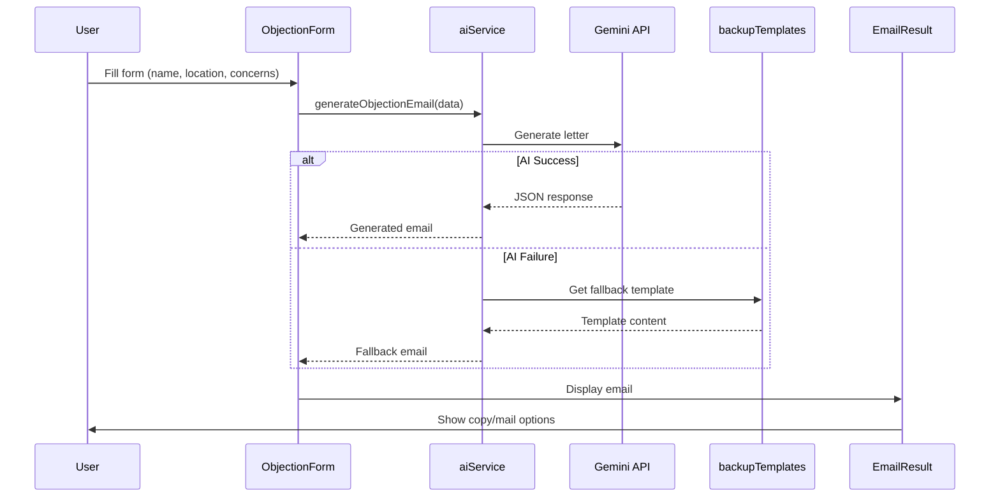

# Architecture - SaveTheBus

## System Architecture

SaveTheBus is a single-page React application (SPA) with a client-side architecture. The application uses Vite as the build tool and is deployed to Vercel.

```
┌─────────────────────────────────────────────────────────────┐
│                         Browser                              │
│  ┌─────────────────────────────────────────────────────────┐ │
│  │                     React App                            │ │
│  │  ┌──────────────┐  ┌──────────────┐  ┌──────────────┐  │ │
│  │  │   App.tsx    │  │ Components   │  │   Services   │  │ │
│  │  │  (Main View) │  │              │  │              │  │ │
│  │  │              │  │ - ObjectionForm│ │ - aiService │  │ │
│  │  │              │  │ - EmailResult │ │ - geminiService│ │ │
│  │  └──────────────┘  └──────────────┘  └──────────────┘  │ │
│  │  ┌──────────────┐  ┌──────────────┐  ┌──────────────┐  │ │
│  │  │   types.ts   │  │ constants.ts │  │backupTemplates│ │ │
│  │  │              │  │              │  │     .ts      │  │ │
│  │  └──────────────┘  └──────────────┘  └──────────────┘  │ │
│  └─────────────────────────────────────────────────────────┘ │
└─────────────────────────────────────────────────────────────┘
                              │
                              ▼
                    ┌─────────────────┐
                    │  Google Gemini  │
                    │      AI API     │
                    └─────────────────┘
```

## Source Code Paths

### Root Level Files
- `App.tsx` - Main application component, handles routing between action/knowledge views
- `index.tsx` - React entry point and DOM mounting
- `index.html` - HTML template with Tailwind CDN and Font Awesome
- `types.ts` - TypeScript type definitions
- `constants.ts` - Translation strings, system prompts, and configuration
- `backupTemplates.ts` - Fallback letter templates for when AI fails
- `vite.config.ts` - Vite build configuration with environment variable handling
- `vercel.json` - Vercel deployment configuration (API proxy for OpenRouter)
- `tsconfig.json` - TypeScript compiler configuration

### Components Directory (`components/`)
- `ObjectionForm.tsx` - Form for user input (name, location, concerns, tone)
- `EmailResult.tsx` - Display generated letter with copy and email actions

### Services Directory (`services/`)
- `aiService.ts` - Main AI service with fallback to templates
- `geminiService.ts` - Direct Gemini API integration (appears to be unused/alternative)

## Key Technical Decisions

### 1. Client-Side Only Architecture
- No backend server required
- All processing happens in the browser
- AI API calls made directly from client (API key exposed via build-time injection)
- Email delivery via mailto links (no server-side email sending)

### 2. Dual Generation Modes
- **Auto-Draft Mode**: AI generates letter from scratch based on selected concerns
- **Manual Mode**: User provides text, AI optimizes and polishes it

### 3. Fallback System
- If AI generation fails, falls back to pre-written templates
- Three templates per language: General, Women's Focus, Rural Focus
- Ensures the application always works even when AI services are unavailable

### 4. Bilingual Support
- All content available in English and Tamil
- Language toggle in navigation bar
- Translations stored in `constants.ts` for easy maintenance

### 5. Environment Variable Injection
- API key injected at build time via Vite's `define` configuration
- In production, `GEMINI_API_KEY` must be set in Vercel environment variables

## Design Patterns

### 1. Component Pattern
- Functional components with React hooks
- Props interfaces defined for type safety
- State management via `useState` and `useEffect`

### 2. Service Pattern
- AI logic separated into service modules
- Clean separation between UI and business logic
- `aiService.ts` handles all AI interactions with fallback logic

### 3. Enum Pattern
- `ObjectionTone` enum for letter tone options
- `GenerationMode` enum for auto/manual modes
- Type-safe selection of options

### 4. Configuration Pattern
- All constants and translations centralized in `constants.ts`
- System instruction for AI defined as constant
- Easy to modify prompts and translations

## Component Relationships



## Critical Implementation Paths

### Letter Generation Flow

1. User fills form in [`ObjectionForm`](components/ObjectionForm.tsx)
2. Form submission triggers [`generateObjectionEmail()`](services/aiService.ts:7)
3. AI service attempts to call Gemini API with structured prompt
4. If successful, returns generated letter with subject and body
5. If failed, falls back to [`BACKUP_TEMPLATES`](backupTemplates.ts:4)
6. Result passed to [`EmailResult`](components/EmailResult.tsx) for display

### Language Toggle Flow

1. User clicks language button in navigation
2. [`App.tsx`](App.tsx:9) state updates with new language
3. All components re-render with new translations from [`TRANSLATIONS`](constants.ts:14)
4. Form fields update with translated labels and placeholders

### Email Submission Flow

1. User clicks "Open Mail App" in [`EmailResult`](components/EmailResult.tsx:20)
2. Constructs mailto URL with encoded subject and body
3. Opens user's default email client
4. User reviews and sends manually

## Data Flow



## State Management

- **App Level**: Language, view mode (action/knowledge), generated email, days remaining
- **Form Level**: Form data (name, location, tone, concerns, mode, custom text), loading state
- **Result Level**: Copy confirmation state

No external state management library (Redux, Zustand, etc.) - using React's built-in `useState` and `useContext` is sufficient for this application's complexity.
